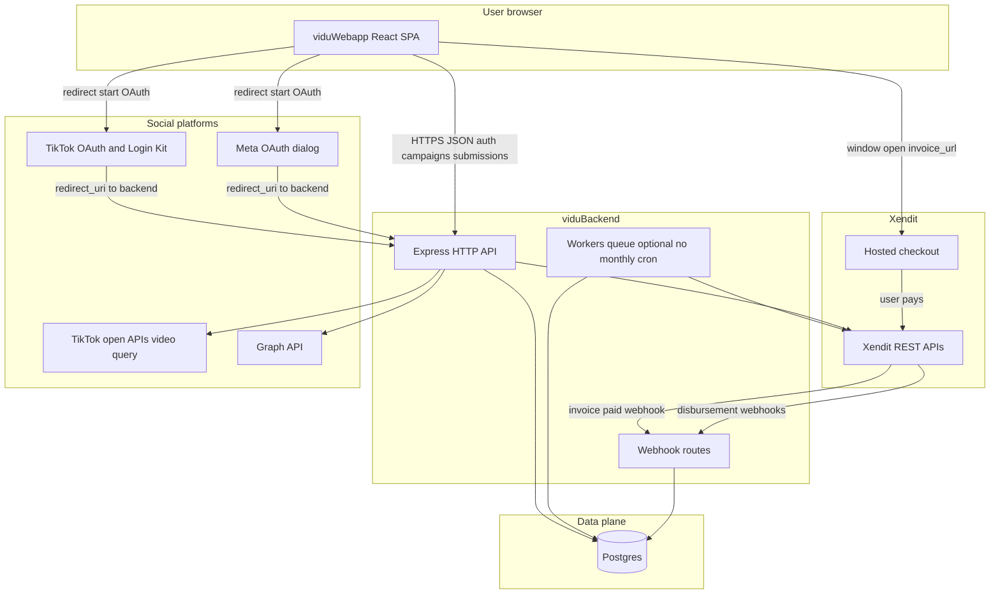
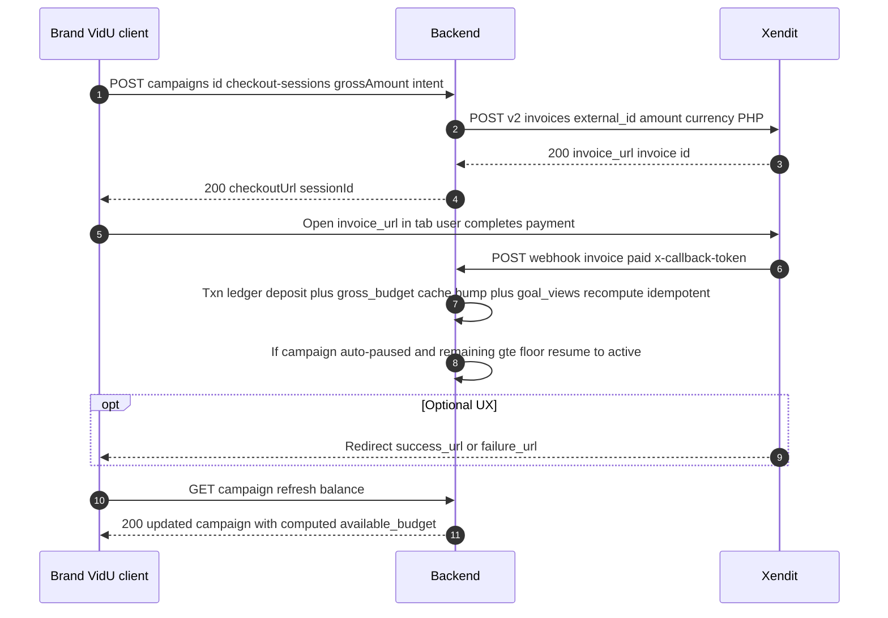
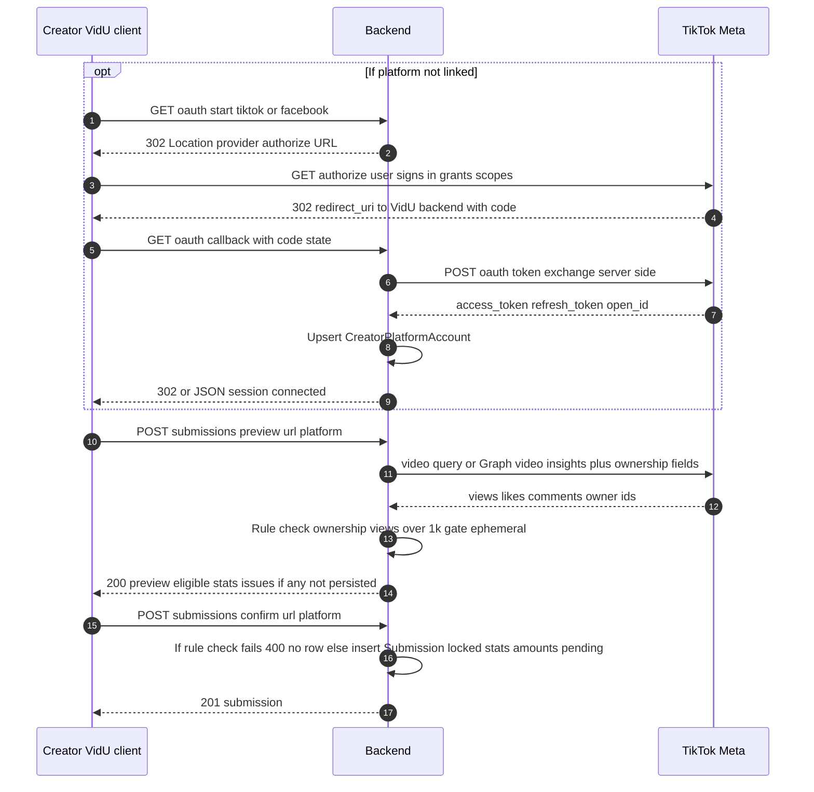
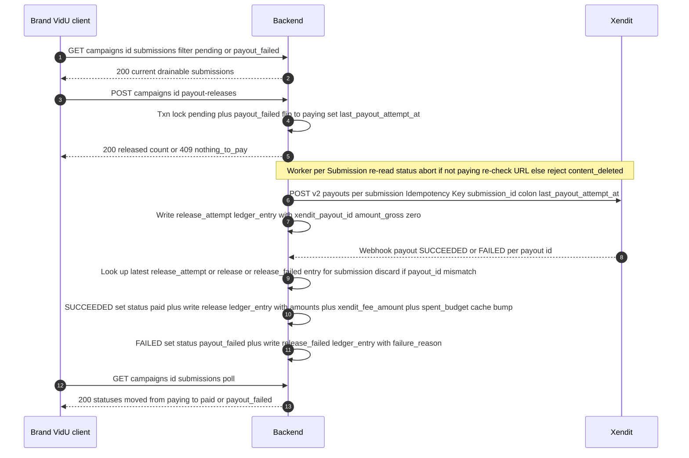
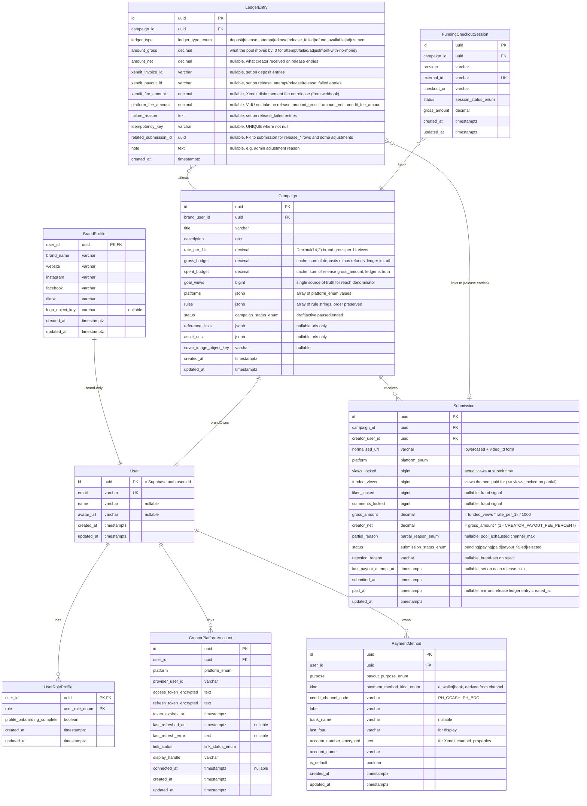

# Backend and database plan (UI-scoped)

## Source of truth

All entities, enums, and money rules in this plan map to the TypeScript models and pages under [vidu-webapp/src](vidu-webapp/src), especially [vidu-webapp/src/lib/mockData.ts](vidu-webapp/src/lib/mockData.ts), stores in [vidu-webapp/src/lib/stores/](vidu-webapp/src/lib/stores/), and routes in [vidu-webapp/src/App.tsx](vidu-webapp/src/App.tsx). The webapp currently has **no HTTP client**; this plan is what a real API must satisfy when you replace local state.

**Explicit exclusions (UI does not ship them):**

- **TikTok yellow basket**: submit checkbox and payout split are commented in [vidu-webapp/src/pages/creator/campaigns/CampaignDetailPage.tsx](vidu-webapp/src/pages/creator/campaigns/CampaignDetailPage.tsx); [mockData.ts](vidu-webapp/src/lib/mockData.ts) keeps optional `hasTikTokYellowBasket` / `isYellowBasket` for types only — **no v1 product logic or endpoints** unless you uncomment the UI first.
- **[ContentTrustBadges.tsx](vidu-webapp/src/components/ContentTrustBadges.tsx)** is not referenced elsewhere in `src`; do not add APIs solely for it.

**Auth providers in UI:** email (6-digit code) + Google button ([AuthPage.tsx](vidu-webapp/src/pages/auth/AuthPage.tsx)) — implement via **Supabase Auth** (see **Auth and session** + **Implementation notes → Auth**). **Not in UI:** TikTok/Facebook as login providers — only **creator platform connect** (TikTok vs Facebook separately) in onboarding/account ([creatorProfileStore.ts](vidu-webapp/src/lib/stores/creatorProfileStore.ts), [ProfileOnboardingPage.tsx](vidu-webapp/src/pages/onboarding/ProfileOnboardingPage.tsx)).

---

## Architecture and user flows

**Brand vs creator (MVP UI):** **Brands** do **not** use TikTok/Meta OAuth or server-side social APIs. They **create and fund campaigns**, review submissions, and run payouts—integrations are **VidU client → backend → Xendit** (plus Postgres). Brand profile “social” fields in the UI are **manual URL strings**, not platform logins. **Creators** are the only role that **OAuth-connects TikTok/Meta** and triggers **video/stats** API calls for submit preview.

This section mixes diagram types:

| What you see     | Usual name                                | What it shows                                                                                            |
| ---------------- | ----------------------------------------- | -------------------------------------------------------------------------------------------------------- |
| First diagram    | **System context diagram** (C4 _Context_) | Whole product plus external systems; TikTok/Meta arrows are **creator-side** paths through the same SPA. |
| Diagrams 2 and 4 | **Sequence diagrams**                     | **Brand client → Backend → Xendit** (money flows only).                                                  |
| Diagram 3        | **Sequence diagrams**                     | **Creator client → Backend → TikTok/Meta** (no Xendit).                                                  |

Mermaid syntax: `flowchart` for the context view; `sequenceDiagram` for the lane-style flows; `erDiagram` for the database model below.

### 1. System context diagram (external systems and trust boundaries)



Notes:

- **Webhooks** hit **hooks** (dedicated routes, no session cookie required; verify `x-callback-token` / signatures). The SPA never receives Xendit webhooks.
- **OAuth `redirect_uri`** is normally the **backend** (code exchange server-side), then backend redirects to the SPA with a short-lived success/error query or sets session and sends the user to `/account` or `/campaigns`. **Only creators** hit TikTok/Meta OAuth in MVP; the same SPA binary serves brands without those steps.

### 2. Sequence diagram — brand fund campaign (lanes: Brand client Backend Xendit)

No TikTok/Meta in this flow. **Webhook → ledger** is the source of truth; redirect is optional UX.



### 3. Sequence diagram — creator connect and submit (lanes: Creator client Backend TikTok/Meta)

No Xendit column in this flow. OAuth and stats calls hit **TikTok/Meta** depending on `platform`.



### 4. Sequence diagram — brand payout release (lanes: Brand client Backend Xendit)

No batch entity, no TikTok/Meta. One backend lifeline; worker may be the same deploy.



---

## ERD — data model (UI-aligned, final for VidU webapp scope)

This is the **authoritative logical schema** for VidU given the current [vidu-webapp/src](vidu-webapp/src) pages, routes, and [mockData.ts](vidu-webapp/src/lib/mockData.ts) shapes, plus the deliberate MVP simplifications: **single `ratePer1k`**; **no `CampaignAsset` table** (URLs in jsonb); **no batch entity at all** — payout amounts and the full release lifecycle live on `Submission` via a 5-state machine; **rule check not persisted** (ephemeral preview + re-check on submit); **retention computed on read, not stored**; **release-time URL re-check** replaces persisted `livenessStatus`; **ledger is truth, counters are a transactionally-maintained cache**; and **Supabase Auth** with `User.id = auth.users.id`. What remains is implementation (Prisma `schema.prisma`, indexes, constraints), not re-deriving entities from the webapp unless the UI changes.

Mermaid’s attribute grammar is officially `**type name`** (see [Entity Relationship diagrams](https://mermaid.js.org/syntax/entityRelationshipDiagram.html)): the **first** token is their “type” slot and the **second** is their “name” slot, which is the opposite of how most people read SQL columns (**name, then type).

To get a diagram that reads **Name | Type** left to right in the usual way, each line below uses `**ColumnName sqlType optionalKeysOrComment`** — i.e. we put the **logical column name in Mermaid’s first slot** and the **physical SQL type in the second slot. Keys (`PK`, `FK`, `UK`) and notes stay on the line per Mermaid’s rules.

**Naming convention.** Postgres tables and columns are **snake_case** (idiomatic SQL). Prisma model + field names stay **PascalCase / camelCase** (idiomatic JS); each Prisma model uses `@@map("snake_case_table")` and each field uses `@map("snake_case_column")` where the names differ. Example: Prisma field `userId String @map("user_id")` on a model declared with `@@map("user_role_profile")`. The ERD below shows the **physical SQL column names** — what you'll see in `psql` and in migration files.



**Enum / domain types (Postgres enum types, snake_case names — type names keep the prefix even though column names dropped it; the enum is a freestanding type, not a column):** `user_role_enum` (`creator`, `brand`); `platform_enum` (`tiktok`, `facebook`); `link_status_enum` (`connected`, `reconnect`); `payout_purpose_enum` (`creator_payout`, `brand_refund`); `payment_method_kind_enum` (`e_wallet`, `bank`); `campaign_status_enum` (`draft`, `active`, `paused`, `ended`); `submission_status_enum` (`pending`, `paying`, `paid`, `payout_failed`, `rejected`); `partial_reason_enum` (`pool_exhausted`, `channel_max`); `ledger_type_enum` (`deposit`, `release_attempt`, `release`, `release_failed`, `refund_available`, `adjustment`); `session_status_enum` (`pending`, `paid`, `expired`, `failed`).

**Channel codes (not an enum).** `payment_method.xendit_channel_code` stores the wire value Xendit expects (e.g. `PH_GCASH`, `PH_BDO`). The UI label (`"GCash"`, `"BDO"`) comes from a static map in code, not a parallel `payout_kind_enum`. Reject unsupported channel codes at save time against Xendit's published list.

**Naming note:** All three status-bearing tables use a column simply named `status` (`campaign.status`, `submission.status`, `funding_checkout_session.status`). The table name disambiguates; the enum _type_ keeps its prefixed name (`campaign_status_enum` etc.) because enum types are freestanding. If your Mermaid renderer chokes on a literal `status` attribute, that's a rendering-only concern — the SQL is unambiguous.

`**ledger_entry` links and money columns (canonical).\*\*

- `**submission` money (ERD):** persisted columns are only `**gross_amount`** and `**creator_net**`— no platform-fee column on`submission`. A DTO may expose `**gross_amount - creator_net**`as “VidU slice before Xendit” for display only; **after Xendit**, use`**ledger_entry.platform_fee_amount`** on successful `**release**` rows.
- `**related_submission_id`:\*\* **Keep it.** It is the FK that ties `release_attempt`, `release`, `release_failed`, and some `adjustment` rows back to a `**submission`**. Deposits and campaign-level refunds use `**related_submission_id = NULL\*\*`. Without it you would only have `campaign_id`and could not answer “which submission did this payout belong to?” or run stale-webhook matching per submission without scanning JSON in`note`.
- `**amount_gross`:** On a successful `**release`**, the performance gross debited from the brand pool (matches `submission.gross_amount`). On `**release_attempt**`/`**release_failed**`, use `0`unless you intentionally model partial pool movement there (v1:`0`).
- `**amount_net`:** On `**release`**, the PHP amount credited to the creator (matches `submission.creator_net`). Nullable on non-release rows.
- `**xendit_fee_amount`:** On `**release`\*\*, Xendit’s disbursement fee from the webhook (VidU accounting; comes out of VidU’s performance-fee slice, not an extra debit from brand or creator).
- `**platform_fee_amount`:** On `**release`**, VidU’s **net** platform revenue for that line: `**amount_gross - amount_net - xendit_fee_amount`** (store explicitly so finance/reporting can `SUM(platform_fee_amount)` without re-deriving; reconciler can assert the identity within `Decimal` rounding rules).

**Audit timestamps (`created_at` / `updated_at`):** Use on **every row-backed entity that your API mutates** (Prisma `@updatedAt @map("updated_at")` where rows change in place). The ERD lists them explicitly; policy by table:

- `**user`\*\* — `created_at`, `updated_at` (name/avatar/email sync from Supabase or profile edits).
- `**user_role_profile**` — `created_at`, `updated_at` (onboarding flag flips).
- `**brand_profile**` — `created_at`, `updated_at` (brand `PUT` updates socials, logo key, etc.).
- `**creator_platform_account**` — `created_at`, `updated_at` (token refresh, reconnect, handle changes; `last_refreshed_at` / `last_refresh_error` are domain fields, not audit).
- `**payment_method**` — `created_at`, `updated_at` (label, default flag, account fields on edit).
- `**campaign**` — `created_at`, `updated_at` (status transitions, rules edits, budget cache bumps).
- `**submission**` — `**submitted_at**` = insert time; `**updated_at**` on any status / reason change; `**paid_at**` (mirrors successful `release` ledger row’s `created_at`) and `**last_payout_attempt_at**` (each release click) are domain timestamps. No separate `reviewed_at` — brand reject time is captured by `updated_at` when `rejection_reason` is set.
- `**funding_checkout_session**` — `created_at`, `updated_at` (`status` when webhook reconciles).
- `**ledger_entry**` — `**created_at` only**; treat as **append-only** (no `updated_at`, no `UPDATE` rows). The chain `release_attempt → release | release_failed` per submission is the payout audit trail; `**xendit_payout_id`** lives only here (not on `submission`).

DTOs can still **omit** these fields on public JSON unless the UI needs them (for example “last edited” on campaign settings).

**Indexes (high level):**

- `submission(campaign_id, status)` — drains pending+payout_failed, brand inbox filters.
- `submission(creator_user_id, submitted_at desc)` — creator's "my submissions" list.
- **Partial unique** `submission(creator_user_id, normalized_url) WHERE status <> 'rejected'` — global dedup; rejected URLs free up for re-submit.
- `campaign(brand_user_id, status)` — brand's "my campaigns".
- **Unique** `creator_platform_account(user_id, platform)`.
- **Partial unique** `payment_method(user_id, purpose) WHERE is_default` — one default per purpose.
- **Unique** `funding_checkout_session(external_id)` — webhook lookup by external invoice id.
- **Partial unique** `ledger_entry(idempotency_key) WHERE idempotency_key IS NOT NULL` — webhook retry safety.
- `ledger_entry(related_submission_id, created_at desc) WHERE related_submission_id IS NOT NULL` — submission financial history; most-recent-entry lookup (stale-webhook defense, latest failure reason).
- `ledger_entry(xendit_payout_id) WHERE xendit_payout_id IS NOT NULL` — webhook lookup by payout id.
- `ledger_entry(xendit_invoice_id) WHERE xendit_invoice_id IS NOT NULL` — deposit reconciliation lookup.

**Alignment with [vidu-webapp/src/pages](vidu-webapp/src/pages) and [mockData.ts](vidu-webapp/src/lib/mockData.ts):** The schema models only what the product actually needs; not every mockData field becomes a column. MVP simplifications:

1. **No `MonthlyPayoutBatch` / `MonthlyPayoutLine`.** Release is a per-submission state machine; brand UI that today renders `batch.lines` reads `submissions.filter(s => s.campaignId === id && s.status IN ('paying','paid','payout_failed'))` instead.
2. **Rule check is ephemeral.** Preview returns `{ eligible, issues[] }`; `POST /campaigns/{id}/submissions` re-runs the same checks and returns 4xx without inserting on failure. No persisted `ruleCheckResult` / `ruleCheckNote`.
3. **No liveness / trust / retention columns.** At release time the worker re-fetches the content URL; if gone, flip the submission to `rejected` with reason `content_deleted` and skip Xendit. Retention end (creator UI hint) is **computed on read** as `submitted_at + 30 days` and returned in the DTO (no calendar end date on campaigns, see §5).
4. **No `CampaignAsset` table.** `reference_links` and `asset_urls` are jsonb URL arrays; no per-asset labels in v1.
5. **No campaign calendar.** No `start_date` / `end_date` / `runs_until_goal` / `goal_label` — campaigns run until pool exhaustion (auto-pause when `remaining < MIN_PUBLISH_FLOOR`, see "Campaign status transitions") or until the brand manually ends them.
6. **Single `Campaign.rate_per_1k`** (brand gross). Creator rate = `rate_per_1k * (1 - CREATOR_PAYOUT_FEE_PERCENT)`, derived in the DTO. No yellow-basket split.
7. **Single `goal_views`** replaces UI's `estimated_reach` + `post_refund_reach_goal_views`. Set on create; recomputed on deposit; pinned on refund to the already-counted views.
8. **Fees live in backend config**, not on campaign rows. `PLATFORM_DEPOSIT_FEE_PERCENT = 0.15` and `CREATOR_PAYOUT_FEE_PERCENT = 0.20` (creator share derived as `1 - CREATOR_PAYOUT_FEE_PERCENT`). No `Campaign.platform_fee_percent` column.
9. **Pool drains by `gross_amount`** per paid submission. `Campaign.gross_budget` (deposits minus refunds) and `Campaign.spent_budget` (paid `gross_amount` totals from `release` ledger entries) are **transactionally-maintained caches** of the ledger. `net_budget`, `reserved_budget`, `available_budget` are **computed on read** — see "Budget columns" below. `**submission` persists only `gross_amount` and `creator_net`** (ERD): no fee/take column on the row. DTOs may expose `gross_amount - creator_net` for “VidU slice before Xendit” display only; **VidU net after Xendit** is `ledger_entry.platform_fee_amount` on successful `**release`\*\* rows.
10. **Money: `Decimal(14, 2)` end-to-end.** JSON wire as decimal strings to avoid JS float drift.
11. **FCFS partial allocation at submit.** `views_locked` = actual views from provider; `funded_views` = capped to remaining pool AND Xendit channel max. `gross_amount = funded_views * rate_per_1k / 1000`. `partial_reason` (`pool_exhausted` | `channel_max`) is non-null when `funded_views < views_locked`. See "Submissions" for the full submit transaction.
12. **Submission dedup is global per creator.** Partial unique `submission(creator_user_id, normalized_url) WHERE status <> 'rejected'`. `normalized_url` only — no separate `url` column (the canonical form is reconstructed for display).
13. **Submission lifecycle is a 5-state machine.** `pending → paying → paid` on success; `paying → payout_failed` on Xendit terminal failure; brand reject takes any non-`paid` state → `rejected`. Retry = brand clicks Release again; controller transitions `payout_failed → pending` and runs the normal drain.
14. **Stale-webhook defense via the ledger.** The worker writes a `release_attempt` `ledger_entry` (amount_gross=0, `xendit_payout_id` set) when Xendit Create Payout returns a `payout_id`. On a webhook, the handler looks up the most recent `release_attempt`/`release`/`release_failed` ledger entry for that submission and discards the webhook if its `payout_id` doesn't match — defends against late retries of stale attempts. Same principle as `campaign` (no Xendit ids on `submission`; they live on `ledger_entry`).
15. `**User.id`\*\* literally equals Supabase `auth.users.id`. No separate `supabaseAuthId`. Lazy first-request upsert (or Supabase auth-webhook) creates the `User` row before any FK-dependent route runs.
16. `**PaymentMethod**` carries `kind` (`e_wallet` | `bank`), derived server-side from `xendit_channel_code` at save time. Stores `last_four` (display) and `account_number_encrypted` (Xendit channel_properties). The UI label comes from a static channel-code map.
17. **Xendit disbursement fee** and **VidU net take** are stored on the successful `release` `ledger_entry`: `xendit_fee_amount` (from webhook) and `platform_fee_amount = amount_gross - amount_net - xendit_fee_amount` for reporting/reconciler. Brand pays `gross_amount`; creator receives `creator_net` (`amount_net`). Never debits brand or creator beyond those splits.
18. **Campaign rules are an array on the campaign row**, not a separate table. `campaign.rules jsonb` stores `string[]` (array order = display order). UI `rules: string[]` from [mockData.ts](vidu-webapp/src/lib/mockData.ts) maps 1:1.

**Prior normalization** still applies: UI `brandId` → `brand_user_id` FK; `LedgerEntry` / `FundingCheckoutSession` for Xendit audit.

**Intentionally dropped from earlier drafts:** `Campaign.refundablePercent`, `Campaign.minimumPublishBalance`, `Campaign.resumeRequiresAddFunds`, `Campaign.reservedBalance`, `Campaign.platform_fee_percent`, `Campaign.estimated_reach`, `Campaign.post_refund_reach_goal_views`, `Campaign.start_date`, `Campaign.end_date`, `Campaign.runs_until_goal`, `Campaign.goal_label`, `Campaign.sample_url`, `Campaign.cover_color`, `Campaign.planned_gross_budget`, `Campaign.brand_logo_object_key`, `Campaign.campaign_views`, `Campaign.net_budget` (now computed), `Campaign.spent` (renamed `spent_budget`), `CampaignRule` (entity — moved to `Campaign.rules jsonb`), `Content.thumbnailColor`, `Submission.url` (canonical form reconstructed from `normalized_url`), `Submission.reviewed_at` (covered by `updated_at + rejection_reason`), `Submission.platform_fee` column (never in ERD — money on `submission` is only `gross_amount` + `creator_net`; UI may show `gross_amount - creator_net` as a computed field), `Submission.current_xendit_payout_id` (now on `ledger_entry`), `Submission.xendit_fee_amount` (now on `release` ledger entries), `Submission.payout_failure_reason` (now on `release_failed` ledger entries), `PaymentMethod.payoutKind`, `PaymentMethod.account_number_masked` (replaced by `last_four`), `MonthlyPayoutBatch` (entity), `Submission.monthlyPayoutBatchId`, `batchStatusEnum`, ledger `reserve` type, `relatedBatchId`. Each was either a UI-only display tint, a constant the UI hardcodes, derivable on read, transactional data better captured by ledger entries, or made redundant by the no-batch / no-calendar / config-driven-fees decisions.

### Backend fee config

Fees are server policy. They live in `config/fees.ts` (env-overridable) and are **never** read from client input or duplicated on `campaign` rows. Changing a percentage is a single backend deploy; the UI gets effective rates from API DTOs.

```ts
// config/fees.ts
export const PLATFORM_DEPOSIT_FEE_PERCENT = 0.15; // VidU's cut of every brand deposit
export const CREATOR_PAYOUT_FEE_PERCENT = 0.2; // VidU's cut of every creator payout
// Derived (never stored as a 3rd constant):
export const CREATOR_PAYOUT_SHARE = 1 - CREATOR_PAYOUT_FEE_PERCENT; // 0.80
// Auto-pause threshold (remaining pool below this → campaign auto-paused):
export const MIN_PUBLISH_FLOOR_PHP = 500; // Decimal as PHP
```

**Xendit disbursement fee** is recorded on the `release` ledger entry as `ledger_entry.xendit_fee_amount`, and **VidU net take after Xendit** as `ledger_entry.platform_fee_amount` — **both come out of VidU's 20% performance fee**, never debited from the brand's pool or the creator's net. Brand pays `gross_amount` from pool; creator receives `creator_net`; VidU keeps `(gross_amount - creator_net) - xendit_fee` as net revenue (`platform_fee_amount`).

### Xendit channel limits

Per-channel min/max payout thresholds live in `config/xendit_channel_limits.ts`. PH baseline (verify at app review / deploy):

```ts
// config/xendit_channel_limits.ts
export const XENDIT_CHANNEL_LIMITS: Record<
  string,
  { min: number; max: number }
> = {
  PH_GCASH: { min: 100, max: 500_000 },
  PH_MAYA: { min: 100, max: 50_000 },
  PH_GRABPAY: { min: 100, max: 50_000 },
  PH_SHOPEEPAY: { min: 100, max: 50_000 },
  PH_BDO: { min: 100, max: 50_000 },
  PH_BPI: { min: 100, max: 50_000 },
  // ... add channels as Xendit publishes them
};
```

These limits **bite at submit time**, not release time: the API rejects a submission whose projected `creator_net` is below the creator's default channel `min`, and caps `funded_views` when the full earnings would exceed the channel `max`. See "Submissions → FCFS partial allocation" for the submit transaction.

### Budget columns — store 2, compute 3

`campaign.gross_budget` and `campaign.spent_budget` are **transactionally-maintained caches** of the ledger. The other three values (`net_budget`, `reserved_budget`, `available_budget`) are **computed on read** and returned in the `Campaign` DTO. Every event that moves money updates the cache in the same DB transaction as the matching `ledger_entry` insert.

| Field              | Stored?         | Definition                                                                                                                                                                                                                   |
| ------------------ | --------------- | ---------------------------------------------------------------------------------------------------------------------------------------------------------------------------------------------------------------------------- |
| `gross_budget`     | **yes** (cache) | `SUM(ledger_entry.amount_gross WHERE ledger_type='deposit') - SUM(ledger_entry.amount_gross WHERE ledger_type='refund_available')`. Bumped on `invoice.paid` deposit webhook; decremented on `POST /campaigns/{id}/refunds`. |
| `spent_budget`     | **yes** (cache) | `SUM(ledger_entry.amount_gross WHERE ledger_type='release' AND campaign_id=?)`. Bumped on `payout.SUCCEEDED` webhook.                                                                                                        |
| `net_budget`       | computed        | `gross_budget * (1 - PLATFORM_DEPOSIT_FEE_PERCENT)` — pure arithmetic.                                                                                                                                                       |
| `reserved_budget`  | computed        | `SUM(submission.gross_amount WHERE campaign_id=? AND status IN ('pending','paying','payout_failed'))` — obligations the brand still owes. Includes `payout_failed` because those rows will be retried.                       |
| `available_budget` | computed        | `net_budget - spent_budget - reserved_budget` — what's free for new submissions and refunds.                                                                                                                                 |

**Reconciler.** Daily cron (and ad-hoc `POST /admin/reconcile-campaign/:id`) recomputes `gross_budget` and `spent_budget` from `ledger_entry` and asserts equality with the stored cache. Alerts on drift > 0.

### External APIs — Xendit (two products)

Host: `https://api.xendit.co` ([Xendit API reference](https://docs.xendit.co/apidocs)).

**1) Brand fund / top-up — Payment Link (hosted checkout)**  
Product name in Xendit docs is often **Payment Links** / **Invoice**; the API your UI already anticipates is a **one-time hosted URL** (`invoice_url` on `checkout.xendit.co`). Implement with:

| Step                | HTTP            | Path / endpoint             | Notes                                                                                                                                                                                                                                                                  |
| ------------------- | --------------- | --------------------------- | ---------------------------------------------------------------------------------------------------------------------------------------------------------------------------------------------------------------------------------------------------------------------- |
| Create payment link | `POST`          | `/v2/invoices`              | Body: `external_id`, `amount`, `currency` (`PHP`), optional `description`, `invoice_duration`, `success_redirect_url`, `failure_redirect_url` (see Checkout UX), `metadata` (`campaignId`, `intent`: `add_funds` or `initial_publish`). Response: `id`, `invoice_url`. |
| Optional fetch      | `GET`           | `/v2/invoices/{invoice_id}` | Reconcile if webhook is delayed.                                                                                                                                                                                                                                       |
| Webhook — verify    | Incoming `POST` | `/webhooks/xendit`          | Verify `x-callback-token` (and/or signature headers) per [integration security](https://docs.xendit.co/docs/integration-security).                                                                                                                                     |
| Webhook — paid      | (invoice body)  | Invoice callback            | Authoritative credit when paid; fields typically include `id`, `external_id`, `status`, `amount`, `paid_amount`, `currency`, `paid_at` — see [InvoiceCallback](https://github.com/xendit/xendit-php/blob/master/docs/Invoice/InvoiceCallback.md).                      |

**2) Creator → pay-out — Xendit Payouts API only**

VidU **does not** implement **Dashboard batch upload** or Excel-based disbursement. All creator (and any brand refund rail) payouts go through the **Payouts API** so behavior stays **server-driven and auditable** in your backend.

Use **[Create a payout](https://docs.xendit.co/apidocs/create-payout)** (e.g. `POST /v2/payouts` for PHP) with `channel_code` (e.g. `PH_GCASH`) and `channel_properties` for recipient details. Implement release as a worker/queue that, for each `**Submission`** in `**paying**` (after URL re-validation), issues one **Create Payout** with a stable `**reference_id`** and `**Idempotency-Key**`(e.g.`submission.id`+`last_payout_attempt_at`). Subscribe to **payout webhooks** and reconcile with **GET payout** if needed.

**Ledger:** keep pool balances and obligations in `**ledger_entry`\*\* / campaign caches (`gross_budget`, `spent_budget`); Xendit payouts execute only what your backend enqueues after the brand confirms release—no file upload step.

**PaymentMethod and channel codes:** Persist `**xendit_channel_code`** and properties that match Xendit’s **published Philippines channel codes** (examples: `PH_GCASH`, `PH_BDO`). Map UI choices to a validated `**channel_code`+`channel_properties`\*\* before save and before Create Payout; reject unsupported combinations.

**Note:** Xendit also offers **Payment Sessions** (`POST /sessions`) as a newer unified checkout; you can swap funding from `/v2/invoices` to Sessions later while keeping Payment Link–style UX for the brand.

#### Checkout UX: separate “success page” vs in-app?

- **Do not rely on the redirect alone** to credit the wallet: the **webhook** (or server-side GET of the invoice) is the source of truth. The user can close the tab before returning to your app.
- **You do not need a separate marketing site.** Set `success_redirect_url` / `failure_redirect_url` to **normal SPA routes** inside VidU (e.g. `/brand/campaigns/:id?tab=budget&funding=success`). On load, call `**GET /brands/campaigns/{id}`\*\* (or rely on webhook-driven state) so the UI matches reality.
- **Payouts to creators** are **async**: there is usually **no payer redirect**. Creators see status `**paid`** when your backend processes **per-payout** Xendit webhooks (one Create Payout per **submission**) and updates `**Submission`\*\* + ledger — in-app refresh or polling is enough.

### Funding UX (webapp — no new pages required)

If you prefer **zero** dedicated success/failure routes, you can still pass redirect URLs that land on the **same campaign detail** with query flags and show a toast/banner after `GET` shows updated balance—but lightweight dedicated query params on existing pages are easier to support deep links from email receipts later.

### External APIs — TikTok (connect + stats + ownership)

Base for TikTok Login and API: `https://www.tiktok.com` (authorize) and `https://open.tiktokapis.com` (resource APIs). See [TikTok for Developers](https://developers.tiktok.com/).

| Step                 | HTTP             | Path                                          | Purpose                                                                                                                                                                                                                                                                                                                                                                                                                                                                 |
| -------------------- | ---------------- | --------------------------------------------- | ----------------------------------------------------------------------------------------------------------------------------------------------------------------------------------------------------------------------------------------------------------------------------------------------------------------------------------------------------------------------------------------------------------------------------------------------------------------------- |
| OAuth — authorize    | Browser redirect | `https://www.tiktok.com/v2/auth/authorize/`   | Login Kit; query params `client_key`, `scope`, `redirect_uri`, `state`, `response_type=code`. Request **only scopes required** for MVP (e.g. `video.list` for [video query](https://developers.tiktok.com/doc/tiktok-api-v2-video-query/) — stats + implicit ownership). Do **not** request unrelated `user.read` or messaging scopes; re-check TikTok’s scope list at app review time.                                                                                 |
| OAuth — access token | `POST`           | `https://open.tiktokapis.com/v2/oauth/token/` | Exchange `code` for `access_token`, `refresh_token`, `expires_in`, `open_id`.                                                                                                                                                                                                                                                                                                                                                                                           |
| OAuth — refresh      | `POST`           | `https://open.tiktokapis.com/v2/oauth/token/` | `grant_type=refresh_token` per TikTok docs.                                                                                                                                                                                                                                                                                                                                                                                                                             |
| Stats + ownership    | `POST`           | `https://open.tiktokapis.com/v2/video/query/` | Headers: `Authorization: Bearer <user access token>`, `Content-Type: application/json`. Query: `fields` — include at least `id,view_count,like_count,comment_count,share_count` (see [Video object](https://developers.tiktok.com/doc/tiktok-api-v2-video-object)). Body: `filters: { "video_ids": ["<id>"] }` (up to 20 ids). Response `data.videos[]`: videos that do not belong to the user are omitted, which supports ownership validation after URL → `video_id`. |

**URL → `video_id`:** Implement a small resolver (regex / oEmbed / TikTok’s URL rules) server-side; do not send arbitrary URLs to TikTok without normalizing to a `video_id`.

**Research API:** `https://open.tiktokapis.com/v2/research/video/query/` exists for approved research use cases; for normal creator-linked accounts, **Display API `video.query` + `video.list`** is the practical path.

`**CreatorPlatformAccount`:\*\* persist encrypted tokens; re-request only the scopes above on connect/refresh — avoid TikTok “wide” scopes you do not use.

### External APIs — Meta / Facebook (connect + stats + ownership)

Graph host: `https://graph.facebook.com`. Version in paths below is illustrative (`v24.0` or current [Graph API version](https://developers.facebook.com/docs/graph-api/changelog)); pin one version in your app config.

**Least-privilege:** request the **smallest permission set** App Review will approve for (1) linking the creator identity to `providerUserId`, and (2) reading **only** fields needed for submit preview (`from`, selected insights). Avoid Page admin scopes unless the content is actually Page-hosted and required.

| Step                      | HTTP             | Path                                                             | Purpose                                                                                                                                                                                                                                                                                                                                                      |
| ------------------------- | ---------------- | ---------------------------------------------------------------- | ------------------------------------------------------------------------------------------------------------------------------------------------------------------------------------------------------------------------------------------------------------------------------------------------------------------------------------------------------------ |
| OAuth — authorize         | Browser redirect | `https://www.facebook.com/{version}/dialog/oauth`                | Meta Login with **minimal scopes** for identity + post stats (see caveat below).                                                                                                                                                                                                                                                                             |
| OAuth — short-lived token | `GET`            | `https://graph.facebook.com/{version}/oauth/access_token`        | `client_id`, `client_secret`, `code`, `redirect_uri`.                                                                                                                                                                                                                                                                                                        |
| OAuth — long-lived        | `GET`            | `https://graph.facebook.com/{version}/oauth/access_token`        | `grant_type=fb_exchange_token`, `fb_exchange_token=...`.                                                                                                                                                                                                                                                                                                     |
| Resolve object            | `GET`            | `https://graph.facebook.com/{version}/{object-id}`               | `object-id` from reel/post URL; use `fields` minimal set to confirm owner and type (`from`, `permalink_url`, etc.) — exact fields depend on object type and token.                                                                                                                                                                                           |
| Video / Reel insights     | `GET`            | `https://graph.facebook.com/{version}/{video-id}/video_insights` | Query param `metric` — for Reels-style plays use metrics documented there (e.g. `fb_reels_total_plays`, `blue_reels_play_count`) plus engagement as needed. Requires permissions such as `pages_read_engagement` and `read_insights` when the video is on a **Page**; token must be a **Page access token** from someone with **ANALYZE** task on that Page. |

**Important product caveat:** Meta’s `/{video-id}/video_insights` documentation is framed around **Page** videos/reels. Many creator submissions will be **profile** Reels or non-Page posts; insight availability and permissions differ. Your implementation should: (1) parse URL → stable `video_id` (or post id), (2) call `GET /{video-id}` with the creator’s user token to verify `from.id` matches the linked Meta account, (3) call `video_insights` only when the token type supports it — otherwise return a clear error in `/submissions/preview` until App Review adds the right scopes/token type.

---

## API surface (REST shape; adjust to your router style)

Conventions: JSON body/response, `Authorization: Bearer <Supabase JWT>`, role enforced via middleware (JWT carries the role; handlers don't redeclare it in the path). Money values are decimal strings (`"1234.50"`) to match `Decimal(14, 2)` in the DB.

**Addressing rule:**

- `**/me/...`\*\* — anything about the authenticated user that is role-symmetric in shape (profile, onboarding, payment methods, platform links, submissions, analytics). Handler discriminates by role from JWT.
- `**/brands/...**` — kept only for brand-owned listings/creation that have no creator equivalent (the brand's campaigns).
- `**/campaigns/{id}/...**` — nested resources accessible to both roles; middleware decides who can do what.
- `**/submissions/{id}/...**` — actions on a specific submission; ownership/role checked server-side.
- `**/webhooks/...**`, `**/oauth/...**`, `**/uploads/...**` — flat utility routes.

### Auth and session

**Implementation note:** Use **[Supabase Auth](https://supabase.com/docs/guides/auth)** for email OTP and Google. `User.id` is **literally** Supabase's `auth.users.id` (same UUID). The Express API verifies the JWT via Supabase JWKS on every authed request. The `User` row is lazy-upserted on first sight (or via a Supabase auth-webhook), so FK-dependent routes always find a row.

| Method | Path                    | Who             | Request                         | Response                                                                                                                               |
| ------ | ----------------------- | --------------- | ------------------------------- | -------------------------------------------------------------------------------------------------------------------------------------- | --------------------------------------------------------------------------------------------------------------------- | ------------------------------------------ |
| POST   | `/auth/email/send-code` | guest           | `{ "email": "a@b.com" }`        | `{ "ok": true }` (rate-limited by Supabase)                                                                                            |
| POST   | `/auth/email/verify`    | guest           | `{ "email", "code": "123456" }` | `{ "user", "sessionToken", "requiresRoleSelection" }` — 6-digit validation per [AuthPage.tsx](vidu-webapp/src/pages/auth/AuthPage.tsx) |
| GET    | `/auth/google/start`    | guest           | —                               | redirect to OAuth provider                                                                                                             |
| GET    | `/auth/google/callback` | guest           | query `code`                    | Set cookie / return `{ "user", "sessionToken", "requiresRoleSelection" }`                                                              |
| POST   | `/auth/sign-out`        | authed          | —                               | `{ "ok": true }` — optional; Supabase client can handle revocation                                                                     |
| GET    | `/me`                   | authed          | —                               | `{ "user": AuthUser, "role": "creator"                                                                                                 | "brand"                                                                                                               | null, "profileOnboardingComplete": bool }` |
| PUT    | `/me/role`              | authed, no role | `{ "role": "creator"            | "brand" }`                                                                                                                             | `{ "role" }` — one-shot per user; mirrors [RoleSelectionPage](vidu-webapp/src/pages/onboarding/RoleSelectionPage.tsx) |

### Profile and "about me" routes

`GET`/`PUT /me/profile` returns a **role-discriminated DTO** — creator gets `{ platformLinks: CreatorPlatformLink[] }`; brand gets `{ brandName, logoUrl, website, instagram, facebook, tiktok }`. One route, role-shaped payload.

| Method | Path                       | Who     | Request                                                                                       | Response                                                                                                                                                         |
| ------ | -------------------------- | ------- | --------------------------------------------------------------------------------------------- | ---------------------------------------------------------------------------------------------------------------------------------------------------------------- |
| GET    | `/me/profile`              | authed  | —                                                                                             | role-shaped DTO (creator → platform links; brand → brand profile fields)                                                                                         |
| PUT    | `/me/profile`              | authed  | partial fields + optional multipart `logo` (brand only)                                       | updated profile                                                                                                                                                  |
| POST   | `/me/onboarding/complete`  | authed  | —                                                                                             | `{ "profileOnboardingComplete": true }` — sets flag on `UserRoleProfile` for the current role ([profileOnboarding.ts](vidu-webapp/src/lib/profileOnboarding.ts)) |
| GET    | `/me/payment-methods`      | authed  | —                                                                                             | `{ "methods": PaymentMethod[] }` — unified for creator-payout and brand-refund; server fills `purpose` from JWT role                                             |
| POST   | `/me/payment-methods`      | authed  | `{ "xenditChannelCode", "label", "bankName?", "accountNumber", "accountName", "isDefault?" }` | `{ "method" }` — server validates channel code against Xendit's PH list                                                                                          |
| PATCH  | `/me/payment-methods/{id}` | authed  | partial: `{ "isDefault?", "label?", ... }`                                                    | updated method (toggling `isDefault: true` clears it on the user's other methods of the same purpose)                                                            |
| DELETE | `/me/payment-methods/{id}` | authed  | —                                                                                             | 400 if it's the only default and others exist                                                                                                                    |
| GET    | `/me/platforms`            | creator | —                                                                                             | `{ "platformLinks": CreatorPlatformLink[] }`                                                                                                                     |
| DELETE | `/me/platforms/{platform}` | creator | —                                                                                             | disconnect — mirrors [disconnectPlatform](vidu-webapp/src/lib/stores/creatorProfileStore.ts)                                                                     |
| GET    | `/me/submissions`          | creator | query pagination                                                                              | creator's own submissions across campaigns — [SubmissionsPage](vidu-webapp/src/pages/creator/submissions/SubmissionsPage.tsx)                                    |
| GET    | `/me/analytics`            | authed  | —                                                                                             | role-shaped: creator gets `{ monthly[], yearly[] }` earnings; brand gets performance series                                                                      |

**Payment methods:** one physical table `**payment_method`** (Prisma model `**PaymentMethod**`with`@@map("payment_method")`). JSON responses follow the webapp `**PaymentMethod**`type.`**purpose**` (`creator_payout`vs`brand_refund`) is set server-side from the JWT role, not from the client. The display label comes from a static map in code (e.g. `PH_GCASH`→ GCash);`**xendit_channel_code\*\*` is the authoritative field saved on the row.

### Creator platform OAuth (TikTok / Facebook)

Flat utility routes; both start endpoints require an authenticated creator session. Connect/disconnect for already-linked accounts is at `/me/platforms` above.

| Method | Path                       | Who     | Request                      | Response                                                                                                        |
| ------ | -------------------------- | ------- | ---------------------------- | --------------------------------------------------------------------------------------------------------------- |
| GET    | `/oauth/tiktok/start`      | creator | `redirect_uri` (allowlisted) | redirect to TikTok                                                                                              |
| GET    | `/oauth/tiktok/callback`   | creator | provider params              | upsert `CreatorPlatformAccount`, set `linkStatus = 'connected'`, clear `lastRefreshError`, redirect back to SPA |
| GET    | `/oauth/facebook/start`    | creator | same                         | Meta Login                                                                                                      |
| GET    | `/oauth/facebook/callback` | creator | same                         | same                                                                                                            |

Store **tokens encrypted at rest**, never the masked-PAN equivalent in plain text. On save of a payment method (see `POST /me/payment-methods` above), validate `xenditChannelCode` against Xendit's published PH channel list for [Create Payout](https://docs.xendit.co/apidocs/create-payout). Reject unsupported codes at the boundary.

### File uploads (logos, campaign cover)

UI uses local `FileReader` / blob URLs today. Backend equivalent:

| Method | Path                | Who    | Request                                                                                  | Response                                    |
| ------ | ------------------- | ------ | ---------------------------------------------------------------------------------------- | ------------------------------------------- |
| POST   | `/uploads/presign`  | authed | JSON: `purpose` (`brand_logo` or `campaign_cover`), `contentType`, optional `campaignId` | `{ "uploadUrl", "objectKey", "publicUrl" }` |
| POST   | `/uploads/complete` | authed | `{ "objectKey" }`                                                                        | `{ "publicUrl" }`                           |

### Campaigns (brand)

Fields and validation thresholds from [Campaign](vidu-webapp/src/lib/mockData.ts), [CreateCampaignPage](vidu-webapp/src/pages/brand/campaigns/CreateCampaignPage.tsx) (`MIN_BRAND_RATE_PER_1K = 35`, `MIN_GROSS_CAMPAIGN_BUDGET = 10_000`, spendable ≥ 10_000 after 15% fee for publish), and brand detail [PUBLISH_FLOOR = 10_000](vidu-webapp/src/pages/brand/campaigns/CampaignDetailPage.tsx).

| Method | Path                     | Who     | Request                                                                                                                                                                                      | Response                                                                   |
| ------ | ------------------------ | ------- | -------------------------------------------------------------------------------------------------------------------------------------------------------------------------------------------- | -------------------------------------------------------------------------- |
| GET    | `/brands/campaigns`      | brand   | query: `status?, page`                                                                                                                                                                       | `{ "items": Campaign[], "page" }`                                          |
| POST   | `/brands/campaigns`      | brand   | create body: title, description, `ratePer1k`, `plannedGrossBudget` or net budget, platforms[], rules[], optional `referenceLinks` / `assetUrls` (JSON url arrays), cover key                 | `{ "campaign" }` status `draft` unless funded                              |
| GET    | `/brands/campaigns/{id}` | brand   | —                                                                                                                                                                                            | full `Campaign` + derived `availableBalance` (server computes from ledger) |
| PATCH  | `/brands/campaigns/{id}` | brand   | partial: copy, platforms, `ratePer1k`, rules, reference/asset URLs, pause/resume/close actions exposed in [CampaignDetailPage](vidu-webapp/src/pages/brand/campaigns/CampaignDetailPage.tsx) | updated campaign                                                           |
| GET    | `/campaigns`             | creator | query: active only                                                                                                                                                                           | list for browse (no drafts)                                                |
| GET    | `/campaigns/{id}`        | creator | —                                                                                                                                                                                            | public-safe campaign card fields                                           |

### Campaign status transitions

`campaign_status_enum` is `draft | active | paused | ended`. Transition matrix:

| From → To                    | Trigger                                                                                                          | Notes                                                                                                                                                    |
| ---------------------------- | ---------------------------------------------------------------------------------------------------------------- | -------------------------------------------------------------------------------------------------------------------------------------------------------- |
| `draft` → `active`           | `invoice.paid` webhook on the campaign's first checkout-session                                                  | First funding crosses publish floor; written in same txn as ledger `deposit` + `gross_budget` bump.                                                      |
| `active` → `paused` (manual) | `PATCH /brands/campaigns/{id}` body `{ status: 'paused' }`                                                       | Hides from creator browse; existing submissions visible to brand.                                                                                        |
| `active` → `paused` (auto)   | Any commit that reduces remaining pool (submit, refund, release) when `available_budget < MIN_PUBLISH_FLOOR_PHP` | Same txn as the triggering commit. Logged in `note` of a `ledger_entry { type: 'adjustment', amount_gross: 0 }` or a separate audit log.                 |
| `paused` → `active` (manual) | `PATCH /brands/campaigns/{id}` body `{ status: 'active' }`                                                       | If `available_budget < MIN_PUBLISH_FLOOR_PHP`, server returns `409 below_publish_floor` — brand must deposit first.                                      |
| `paused` → `active` (auto)   | `invoice.paid` webhook                                                                                           | If the campaign was previously auto-paused and the new `available_budget >= MIN_PUBLISH_FLOOR_PHP`, resume automatically in the same txn as the deposit. |
| `active`/`paused` → `ended`  | `PATCH /brand/campaigns/{id}` body `{ status: 'ended' }`                                                         | Terminal — no new submissions, no further auto-pause/resume. Payout releases still allowed to drain remaining `pending`/`payout_failed`.                 |

Allowed actions per state:

| Action                                               | draft | active | paused | ended |
| ---------------------------------------------------- | ----- | ------ | ------ | ----- |
| Creator submit                                       | ❌    | ✅     | ❌     | ❌    |
| Brand reject submission                              | ✅    | ✅     | ✅     | ✅    |
| Brand release payout                                 | ❌    | ✅     | ✅     | ✅    |
| Refund `available_budget`                            | ✅    | ✅     | ✅     | ✅    |
| Add funds (`POST /campaigns/{id}/checkout-sessions`) | ✅    | ✅     | ✅     | ❌    |

`POST /campaigns/{id}/submissions` returns `409 campaign_not_active` if status is anything other than `active`.

### Funding, top-up, refund (brand + Xendit)

UI opens Xendit (`window.open`) for add funds / fund & publish ([CampaignDetailPage](vidu-webapp/src/pages/brand/campaigns/CampaignDetailPage.tsx), [CreateCampaignPage](vidu-webapp/src/pages/brand/campaigns/CreateCampaignPage.tsx)).

| Method | Path                                | Who    | Request                                                             | Response                                                                                                                                                                                                                                                                                                                                                                                                                                                                                                                                                                                                                                                                                                                                                           |
| ------ | ----------------------------------- | ------ | ------------------------------------------------------------------- | ------------------------------------------------------------------------------------------------------------------------------------------------------------------------------------------------------------------------------------------------------------------------------------------------------------------------------------------------------------------------------------------------------------------------------------------------------------------------------------------------------------------------------------------------------------------------------------------------------------------------------------------------------------------------------------------------------------------------------------------------------------------ |
| POST   | `/campaigns/{id}/checkout-sessions` | brand  | JSON: `grossAmountPhp`, `intent` (`add_funds` or `initial_publish`) | `{ "checkoutUrl", "sessionId" }` — create Xendit invoice; persist `FundingCheckoutSession`                                                                                                                                                                                                                                                                                                                                                                                                                                                                                                                                                                                                                                                                         |
| POST   | `/campaigns/{id}/refunds`           | brand  | `{ "amountPhp"? }` (omit = full `available_budget`)                 | Debit only `available_budget`; `409 exceeds_available` if over; `refund_available` ledger row; pin `goal_views` per plan text                                                                                                                                                                                                                                                                                                                                                                                                                                                                                                                                                                                                                                      |
| POST   | `/webhooks/xendit`                  | server | Raw signed body (invoice **or** payout)                             | Verify `x-callback-token`. **Invoice paid:** `deposit` ledger + `gross_budget` + `goal_views` + auto-resume when applicable. **Payout:** resolve `submission` by `reference_id`; find latest `ledger_entry` for that submission with `ledger_type IN ('release_attempt','release','release_failed')` ordered by `created_at DESC`; **if `xendit_payout_id` ≠ webhook payout_id, ACK and ignore (stale).** **SUCCEEDED:** `submission` → `paid`, `paid_at`; insert `release` with `amount_gross`, `amount_net`, `xendit_fee_amount`, `platform_fee_amount` (see ERD), `idempotency_key = 'payout:' + payout_id`; bump `spent_budget`. **FAILED:** `submission` → `payout_failed`; insert `release_failed` with `failure_reason`. No Xendit columns on `submission`. |

### Submissions (creator)

#### Submit-time gates (server-enforced, not UI-only)

Before any provider call:

1. **Default payment method.** Creator must have a `payment_method` row with `purpose='creator_payout'` and `is_default=true`. Otherwise return `400 payment_method_required`. The UI mirrors this gate on [CreatorCampaignDetailPage](vidu-webapp/src/pages/creator/campaigns/CampaignDetailPage.tsx); a crafted client cannot skip it.
2. **Platform connected.** Creator's `creator_platform_account` for the submission's platform must have `link_status='connected'`. Otherwise `401 platform_reconnect_required`.
3. **Campaign active.** `campaign.status = 'active'` (not `draft|paused|ended`). Otherwise `409 campaign_not_active`.
4. **Views > 1,000.** Server-fetched `views_locked > 1000`. Otherwise `400 below_views_floor`.

#### FCFS partial allocation — submit transaction

VidU campaigns are **first-come-first-served**: when the pool fills, late submissions get partial earnings or are rejected. The submit handler serializes all submits per-campaign via `SELECT FOR UPDATE` on the `campaign` row so two parallel submits can't double-allocate.

```
POST /campaigns/{id}/submissions { url, platform }
  // Gates 1–2 above run first (outside the txn — they don't depend on campaign state)
  BEGIN
  campaign = SELECT * FROM campaign WHERE id = ? FOR UPDATE
  IF campaign.status <> 'active': ABORT, 409 campaign_not_active
  // Refetch authoritative stats from TikTok/Meta. Client-provided values are ignored.
  stats = provider.fetch(platform, url)   // views, likes, comments, ownership
  IF !stats.owned_by_creator: ABORT, 403 ownership_mismatch
  IF stats.views <= 1000: ABORT, 400 below_views_floor
  // Dedup (global per creator)
  existing = SELECT * FROM submission
             WHERE creator_user_id = ? AND normalized_url = ? AND status <> 'rejected'
  IF existing: ABORT, 409 duplicate_submission { existingSubmission: { campaignId, ... } }
  // Compute remaining pool (gross)
  obligated_gross = SUM(gross_amount
                        WHERE campaign_id = ?
                          AND status IN ('pending','paying','payout_failed'))
  net_budget = campaign.gross_budget * (1 - PLATFORM_DEPOSIT_FEE_PERCENT)
  remaining_gross = net_budget - campaign.spent_budget - obligated_gross
  IF remaining_gross <= 0: ABORT, 409 campaign_pool_exhausted
  full_gross = stats.views * campaign.rate_per_1k / 1000
  // Cap by remaining pool AND by Xendit channel max for creator's default channel
  creator_default = SELECT * FROM payment_method
                    WHERE user_id = ? AND purpose='creator_payout' AND is_default
  limits = XENDIT_CHANNEL_LIMITS[creator_default.xendit_channel_code]
  channel_max_gross = limits.max / CREATOR_PAYOUT_SHARE
  capped_gross = min(full_gross, remaining_gross, channel_max_gross)
  partial_reason = NULL
  IF capped_gross < full_gross:
    IF capped_gross == channel_max_gross: partial_reason = 'channel_max'
    ELSE: partial_reason = 'pool_exhausted'
  // Channel min check on the capped value
  creator_net_capped = capped_gross * CREATOR_PAYOUT_SHARE
  IF creator_net_capped < limits.min:
    ABORT, 409 below_minimum_payout { min, channel, views_needed_to_reach_min }
  funded_views = round(capped_gross * 1000 / campaign.rate_per_1k)
  INSERT INTO submission (
    campaign_id, creator_user_id, normalized_url, platform,
    views_locked = stats.views,
    funded_views, gross_amount = capped_gross,
    creator_net = creator_net_capped,
    likes_locked, comments_locked,
    partial_reason, status = 'pending', submitted_at = now()
  )
  // Auto-pause check
  new_remaining = remaining_gross - capped_gross
  IF new_remaining < MIN_PUBLISH_FLOOR_PHP:
    UPDATE campaign SET status = 'paused' WHERE id = ?
  COMMIT
```

**Why `SELECT FOR UPDATE` on the campaign row.** Per-campaign serialization caps throughput at hundreds of submits/sec per campaign — plenty for "100 creators submit at once." Contention is local to one campaign; other campaigns aren't blocked.

**Preview endpoint** runs the same provider fetch and rule check **without** the campaign-row lock or the dedup/cap math — its response is ephemeral and the rate-limited provider call is cached server-side for 60s on `(platform, normalized_url)`.

#### Endpoints

| Method | Path                                  | Who              | Request                 | Response                                                                                                                                                                                                                                                                                                                                                                                   |
| ------ | ------------------------------------- | ---------------- | ----------------------- | ------------------------------------------------------------------------------------------------------------------------------------------------------------------------------------------------------------------------------------------------------------------------------------------------------------------------------------------------------------------------------------------ |
| POST   | `/campaigns/{id}/submissions/preview` | creator          | `{ "url", "platform" }` | `{ "views", "likes", "comments", "ownership_match", "issues"?, "eligible": bool }` — ephemeral. Gates: `400 payment_method_required`, `401 platform_reconnect_required` apply.                                                                                                                                                                                                             |
| POST   | `/campaigns/{id}/submissions`         | creator          | `{ "url", "platform" }` | **201** `{ "submission": CampaignSubmissionDTO }` on success. Error codes: `400 payment_method_required`, `401 platform_reconnect_required`, `409 campaign_not_active`, `403 ownership_mismatch`, `400 below_views_floor`, `409 duplicate_submission` (with `existingSubmission` payload), `409 campaign_pool_exhausted`, `409 below_minimum_payout`. **No row** is inserted on any error. |
| GET    | `/campaigns/{id}/submissions`         | brand or creator | query: `status?, page`  | Returns `{ submissions: CampaignSubmissionDTO[], page }`. Brand sees all; creator sees only their own (filter enforced server-side from JWT role).                                                                                                                                                                                                                                         |

#### CampaignSubmissionDTO

Shared between brand inbox and creator self-view. Denormalizes creator display fields and exposes partial-allocation flags.

```jsonc
{
  "id": "uuid",
  "campaignId": "uuid",
  "creator": {
    "id": "uuid",
    "name": "Alice",
    "avatarUrl": null,
    "platformHandle": "@alice", // from creator_platform_account for this submission's platform
  },
  "url": "https://www.tiktok.com/@alice/video/123", // reconstructed from normalized_url
  "platform": "tiktok",
  "viewsLocked": 30000, // actual views from TikTok/Meta
  "fundedViews": 10000, // views the pool paid for
  "grossAmount": "620.00",
  "creatorNet": "496.00",
  "platformFee": "124.00", // derived: grossAmount - creatorNet
  "partialAllocation": true, // = fundedViews < viewsLocked
  "partialReason": "pool_exhausted", // null | 'pool_exhausted' | 'channel_max'
  "status": "pending",
  "rejectionReason": null,
  "payoutFailureReason": null, // resolved from most-recent release_failed ledger_entry.failure_reason
  "retentionEndAt": "2026-06-15T00:00:00Z", // computed: submitted_at + 30d
  "submittedAt": "...",
  "paidAt": null, // mirrors release ledger_entry.created_at
}
```

#### Duplicate submission payload

When `(creator_user_id, normalized_url)` dedup fires, the response tells the UI which campaign already has it so the creator can be routed there:

```jsonc
{
  "error": "duplicate_submission",
  "message": "This video is already submitted",
  "existingSubmission": {
    "id": "uuid",
    "campaignId": "uuid",
    "campaignTitle": "...",
    "submissionStatus": "pending",
  },
}
```

### Reject a submission

Preset ids in UI: `fraud`, `duplicate`, `requirements`, `policy`, `other` ([CampaignDetailPage](vidu-webapp/src/pages/brand/campaigns/CampaignDetailPage.tsx)). Brand-only via middleware.

| Method | Path                       | Who   | Request                             | Response                                                       |
| ------ | -------------------------- | ----- | ----------------------------------- | -------------------------------------------------------------- |
| POST   | `/submissions/{id}/reject` | brand | `{ "presetId"?, "reason": string }` | `200 { "submission": CampaignSubmissionDTO }` — flips `pending |

### Payout releases (brand, manual)

**No batch entity. No scheduler. No period.** The brand presses **Release payout** whenever they want; the controller drains every `pending` and `payout_failed` submission for the campaign in one shot via a per-submission state machine. New submissions arrive between clicks and ride the next release.

#### Submission state machine

```
pending  ──release click──▶  paying  ──Xendit SUCCEEDED──▶  paid
                              │
                              └─ Xendit FAILED ──▶  payout_failed  ──next release click──▶ pending
brand reject (any non-paid state) ──▶ rejected
release-time URL re-check fails ──▶ rejected (reason: content_deleted)
```

#### Brand UX

- **Campaigns → Payouts:** lists submissions in `pending`, `paying`, `paid`, `payout_failed`, and `rejected` for this campaign. Server-side filter; no batch grouping.
- **Row action:** brand reject via `POST /submissions/{id}/reject` (any non-`paid` state) — drops the row out of the next release.
- **Primary CTA:** **Release payout** → confirmation modal showing the count of `pending + payout_failed` rows and total creator net → `POST /campaigns/{id}/payout-releases` with body `{}`.
- **Progress:** client polls `GET /campaigns/{id}/submissions` and watches `paying → paid|payout_failed`. No "batch is done" event; the UX is "everything has reached a terminal state."
- **Retry:** brand just clicks Release payout again. `payout_failed → pending` happens server-side inside the same release endpoint, then the normal drain runs.

#### Endpoint and behavior

| Method | Path                              | Who   | Request                         | Response                                                                                                                                                                                                                                         |
| ------ | --------------------------------- | ----- | ------------------------------- | ------------------------------------------------------------------------------------------------------------------------------------------------------------------------------------------------------------------------------------------------ |
| POST   | `/campaigns/{id}/payout-releases` | brand | `{}` or `{ "idempotencyKey"? }` | `200 { "released": N }` after flipping rows to `paying`; `409 nothing_to_pay` if zero eligible rows; `409 insufficient_pool` if `SUM(creator_net of locked rows) > available_budget` (defensive — should rarely fire after submit-time capping). |

**Server logic** (`POST /campaigns/{id}/payout-releases`):

1. Open transaction. `SELECT * FROM campaign WHERE id = ? FOR UPDATE` (lock campaign).
2. `SELECT ... FOR UPDATE` all submissions where `campaign_id = ?` and `status IN ('pending', 'payout_failed')`.
3. If zero rows: rollback, return `409 nothing_to_pay`.
4. Compute `SUM(creator_net)` of locked rows. Compute `available_budget = (gross_budget * 0.85) - spent_budget`. If sum > available: rollback, return `409 insufficient_pool { needed, available, shortfall }`. (Defense in depth — should not happen if A1.5 capping is correct, but catches drift.)
5. For each locked row: flip `status = 'paying'`, set `last_payout_attempt_at = now()` (failure details for the previous attempt live only on `ledger_entry`, not on `submission`).
6. Commit. Return `{ released: <count> }` to the brand immediately.
7. **Outside the transaction**, enqueue per-submission work for each newly-`paying` row.

**Worker per submission** (submission carries only its own state; Xendit-attempt facts go into `ledger_entry`):

```
worker(submission_id):
  // 1. Re-read status to defend against brand-reject races
  BEGIN
  s = SELECT * FROM submission WHERE id = ? FOR UPDATE
  IF s.status != 'paying': COMMIT and return (brand rejected or stale enqueue)
  // 2. URL re-check
  result = provider.fetch(s.platform, s.normalized_url)
  IF !result.exists OR !result.accessible:
    UPDATE submission SET status='rejected', rejection_reason='content_deleted'
    COMMIT; return
  COMMIT
  // 3. Load creator's default payment method (re-check; row could have been deleted between submit and now)
  method = SELECT * FROM payment_method
           WHERE user_id = s.creator_user_id AND purpose='creator_payout' AND is_default
  IF !method:
    BEGIN
    UPDATE submission SET status='payout_failed'
    INSERT INTO ledger_entry (campaign_id=s.campaign_id, ledger_type='release_failed',
                              amount_gross=0, related_submission_id=s.id,
                              failure_reason='payment_method_missing')
    COMMIT; return
  // 4. Call Xendit Create Payout with stable idempotency
  resp = xendit.POST('/v2/payouts', {
    reference_id: s.id,
    channel_code: method.xendit_channel_code,
    channel_properties: decrypt(method.account_number_encrypted),
    amount: s.creator_net,
    currency: 'PHP'
  }, headers: { 'Idempotency-Key': s.id + ':' + s.last_payout_attempt_at })
  // 5. Durable record of the attempt — the ledger entry that pins which payout_id is current.
  //    Used by the webhook handler for stale-webhook defense.
  INSERT INTO ledger_entry (campaign_id=s.campaign_id, ledger_type='release_attempt',
                            amount_gross=0, related_submission_id=s.id,
                            xendit_payout_id=resp.payout_id,
                            idempotency_key='attempt:' + s.id + ':' + s.last_payout_attempt_at)
```

**Implementation:** Keep `UPDATE submission … payout_failed` and `INSERT … release_failed` in the **same database transaction** so a terminal payout-failed state never exists without its ledger audit row.

**Webhook handler** (`/webhooks/xendit`, payout branch):

```
on payout webhook { event: 'payout.SUCCEEDED' | 'payout.FAILED', payout_id, reference_id, fee }:
  BEGIN
  s = SELECT * FROM submission WHERE id = reference_id FOR UPDATE
  // Stale-webhook defense: most recent ledger entry for this submission must have a matching payout_id
  latest = SELECT * FROM ledger_entry
           WHERE related_submission_id = s.id
             AND ledger_type IN ('release_attempt','release','release_failed')
           ORDER BY created_at DESC LIMIT 1
  IF latest.xendit_payout_id != webhook.payout_id:
    log 'stale webhook'; ACK 200; COMMIT; return

  IF webhook.event == 'payout.SUCCEEDED':
    UPDATE submission SET status='paid', paid_at=now()
    platform_vidu_net = s.gross_amount - s.creator_net - webhook.fee
    INSERT INTO ledger_entry (campaign_id=s.campaign_id, ledger_type='release',
                              amount_gross=s.gross_amount, amount_net=s.creator_net,
                              xendit_payout_id=webhook.payout_id,
                              xendit_fee_amount=webhook.fee,
                              platform_fee_amount=platform_vidu_net,
                              related_submission_id=s.id,
                              idempotency_key='payout:' + webhook.payout_id)
    UPDATE campaign SET spent_budget = spent_budget + s.gross_amount WHERE id = s.campaign_id
  ELSE IF webhook.event == 'payout.FAILED':
    UPDATE submission SET status='payout_failed'
    INSERT INTO ledger_entry (campaign_id=s.campaign_id, ledger_type='release_failed',
                              amount_gross=0,
                              xendit_payout_id=webhook.payout_id,
                              failure_reason=webhook.failure_code,
                              related_submission_id=s.id,
                              idempotency_key='payout_failed:' + webhook.payout_id)
  COMMIT
```

**Why this is the cleaner design.** The `submission` row owns only its own state (`status`, amounts, content). Every Xendit-side fact — payout id, fee amount, failure reason — lives on a `ledger_entry` row. Matches the principle already followed by `campaign` (no Xendit ids; `funding_checkout_session` holds them for deposits).

**To read "why did this submission's last payout fail?"** join the most recent `release_failed` entry:

```
SELECT failure_reason FROM ledger_entry
  WHERE related_submission_id = ? AND ledger_type = 'release_failed'
  ORDER BY created_at DESC LIMIT 1
```

The `CampaignSubmissionDTO` resolves this in its serializer and surfaces it as `payoutFailureReason` to the UI — the field exists in the DTO, just not as a column on `submission`.

**Idempotency on double-click:** natural. The second click finds zero rows in `pending`/`payout_failed` (the first click moved them all to `paying`) and returns `409 nothing_to_pay`.

**Webhook idempotency:** the partial-unique `ledger_entry(idempotency_key)` index blocks duplicate ledger inserts on webhook retry. The state transition (`paying → paid`) is also idempotent (no-op if already `paid`).

### Dashboard analytics (replace hard-coded mocks)

Creator dashboard mixes **store submissions** with **mock** chart series ([DashboardPage.tsx](vidu-webapp/src/pages/creator/dashboard/DashboardPage.tsx) uses `mockBrandPerformanceMonthly`). Brand dashboard similar pattern expected. Covered by `GET /me/analytics` in the "About me" table above — role-discriminated payload. Creator gets `{ monthly: { period, earnings }[], yearly: ... }`; brand gets the equivalent performance series. No separate route per role.

---

## Implementation notes

### Postman collection and environment docs

- **Postman (maintain with implementation):** Add a **Postman Collection** under the backend repo (e.g. `postman/VidU.postman_collection.json`, optional `postman/VidU.local.postman_environment.json`). **Update it in the same change sets as new HTTP routes**—folders mirroring the plan surface (`auth`, `me`, `brands`, `campaigns`, `submissions`, `webhooks`, `oauth`, `uploads`, `admin`). Use collection/environment variables such as `baseUrl`, `bearerToken` (Supabase session JWT after login), and placeholders like `campaignId` / `submissionId` where it speeds manual QA. For **`POST /webhooks/xendit`**, document raw body + `x-callback-token` (and any signature headers) so invoice/payout callbacks can be replayed safely against a dev server (e.g. via ngrok).
- **`.env.example` + guide:** Commit **`vidu-backend/.env.example`** listing **every** variable the server reads, with a **short comment per line** (purpose, required vs optional, safe default if any). Add or extend a **setup doc** (e.g. `vidu-backend/docs/environment.md` or a dedicated section in `vidu-backend/README.md`) that explains: copying `.env.example` → `.env`, obtaining Supabase (`DATABASE_URL`, JWT verification / JWKS, service vs anon keys if applicable), Xendit keys and webhook verification token, TikTok/Meta OAuth app IDs and redirect URIs, optional fee override envs, local webhook exposure (ngrok/cloudflared), and **never committing secrets**. Refresh the guide whenever a new env var is introduced.

### Auth

- **Email + Google:** Use **[Supabase Auth](https://supabase.com/docs/guides/auth)** (email OTP + Google provider). `User.id` literally equals `auth.users.id` — same UUID, no separate `supabaseAuthId` column. The Express API verifies every JWT via Supabase JWKS. Lazy first-request upsert (or a Supabase auth-webhook) ensures the `User` row exists before any FK-dependent route runs.
- **Role + onboarding:** `UserRoleProfile` is per-`(userId, role)` and carries `profileOnboardingComplete`. `GET /me` drives [ProtectedRoute](vidu-webapp/src/components/guards/ProtectedRoute.tsx) client hydration. `PUT /me/role` sets the role once; `POST /me/onboarding/complete` flips the flag for the current role ([profileOnboarding.ts](vidu-webapp/src/lib/profileOnboarding.ts)).

### Payments (Xendit + internal ledger)

- **Pay-in:** Xendit **Payment Link** via `POST /v2/invoices` (hosted `invoice_url`). **Pay-out:** **Payouts API only** — `POST /v2/payouts` one call per eligible `submission` on release, idempotent via `Idempotency-Key = submission.id:last_payout_attempt_at`. No Dashboard / Excel batch.
- **Ledger is truth, caches are transactionally maintained.** Every mutation to `campaign.gross_budget` / `campaign.spent_budget` happens in the **same DB transaction** as the matching `ledger_entry` insert. `net_budget` / `reserved_budget` / `available_budget` are computed on read (see "Budget columns").
- **Reconciler.** Daily cron + `POST /admin/reconcile-campaign/{id}` recompute `gross_budget` / `spent_budget` from `ledger_entry` and assert equality with the stored cache. Alert on drift > 0.
- **Fees are server-side config**, not per-campaign columns. `PLATFORM_DEPOSIT_FEE_PERCENT = 0.15` on `invoice.paid`; `CREATOR_PAYOUT_FEE_PERCENT = 0.20` on each accrued submission. **Xendit disbursement fee** and **VidU platform take** on a successful payout are recorded on the `ledger_entry` row with `ledger_type = 'release'` (`xendit_fee_amount`, `platform_fee_amount = amount_gross - amount_net - xendit_fee_amount`); never debited from brand or creator beyond those stored splits.
- **Idempotency key conventions on `ledger_entry`:**
  - `invoice.paid` deposit → `"invoice:" + xendit_invoice_id`
  - Brand refund → `"refund:" + refund_request_id` (server-generated UUID per refund call)
  - `payout.SUCCEEDED` release → `"payout:" + xendit_payout_id`
  - Manual admin adjustment → `"adjust:" + admin_action_id`
- **Creator submissions:** require a **default** `payment_method` (`creator_payout`, `is_default`) on preview and submit (`400 payment_method_required` if absent). Payout worker re-checks the row exists before **Create Payout**; if missing, set `payout_failed` with `payment_method_missing`.
- **Refund:** debit only `available_budget` (`= net_budget - spent_budget - reserved_budget`, with `reserved_budget` including `payout_failed`). `409 exceeds_available` if amount > available. On commit: pin `goal_views` to current counted views.
- **Checkout return URLs:** SPA routes + webhook is source of truth; no standalone success/fail pages required.

### TikTok / Facebook (creator)

- Two separate OAuth clients; store `provider_user_id` per platform.
- **Token rotation observability:** on successful refresh, update `last_refreshed_at`; on refresh failure, set `link_status = 'reconnect'` and write the error to `last_refresh_error`.
- **Refresh failure UX:**
  - During `POST /campaigns/{id}/submissions/preview` or `/submissions`: return `401 platform_reconnect_required` with `{ platform }`. SPA routes the creator to the connect flow.
  - During release-time URL re-check in the payout worker: flip submission to `payout_failed` and append a `ledger_entry` with `ledger_type = 'release_failed'` and `failure_reason = 'platform_auth_required'`. Brand sees the reason (DTO joins latest `release_failed`); creator must reconnect before the next release succeeds.
- **Submit preview:** resolve URL → fetch stats via provider APIs; **ownership** = author must equal stored `provider_user_id` for that platform. URL is normalized to `video_id` form before any provider call; short-link (`vm.tiktok.com/...`) expansion via HEAD request first.

### Performance and abuse

- **Preview cache.** `POST /campaigns/{id}/submissions/preview` caches `(platform, normalized_url) → { views, likes, comments, ownership_match }` for 60s server-side. Saves TikTok/Meta quota; per-creator rate limits stay below provider thresholds.
- **Rate limits** per authenticated principal:
  - `POST /campaigns/{id}/submissions/preview` — 30/min per creator
  - `POST /campaigns/{id}/submissions` — 10/min per creator
  - `POST /campaigns/{id}/checkout-sessions` — 10/min per brand
  - `POST /campaigns/{id}/payout-releases` — 2/min per brand per campaign
- **URL normalization:** documented allowlist of accepted URL patterns per platform. HEAD-expand short links before pattern match. Reject unrecognized formats with `400 invalid_url_format`.

### Admin / ops endpoints

Guarded by a separate JWT claim (e.g. `role: 'admin'`) or an IP allowlist; not part of the brand/creator surface.

| Method | Path                                   | Purpose                                                                                                                                                         |
| ------ | -------------------------------------- | --------------------------------------------------------------------------------------------------------------------------------------------------------------- |
| POST   | `/admin/reconcile-campaign/{id}`       | Recompute `gross_budget` / `spent_budget` from `ledger_entry`; assert cache equality; alert on drift.                                                           |
| POST   | `/admin/campaigns/{id}/ledger/adjust`  | Manual `adjustment` ledger entry. Body: `{ amount_gross, reason, idempotency_key }`. Adjusts `gross_budget` (positive or negative).                             |
| POST   | `/admin/submissions/{id}/force-reject` | Reject any submission state, including `paid`, with required audit `reason`. For post-payment fraud; reverses `release` ledger via a paired `adjustment` entry. |
| GET    | `/admin/audit/campaign/{id}`           | Full ledger + submission history dump. CS uses this for support tickets.                                                                                        |

### Jobs / async work

| Job                                | Trigger                                              | Purpose                                                                                                                                                                                                                                                                                                                                                                                                                                                                                                                      |
| ---------------------------------- | ---------------------------------------------------- | ---------------------------------------------------------------------------------------------------------------------------------------------------------------------------------------------------------------------------------------------------------------------------------------------------------------------------------------------------------------------------------------------------------------------------------------------------------------------------------------------------------------------------- |
| **Webhook processor**              | `POST /webhooks/xendit` (invoice + payout)           | Invoice paid → credit ledger + bump `gross_budget` cache + auto-resume if applicable. Payout SUCCEEDED → match latest `ledger_entry` for that submission (`release_attempt` / `release` / `release_failed`) on `xendit_payout_id` (discard stale) → submission `paid` + ledger `release` (with `xendit_fee_amount`, `platform_fee_amount`) + bump `spent_budget`. Payout FAILED → submission `payout_failed` + `release_failed` ledger row with `failure_reason`. Idempotent on ledger via partial-unique `idempotency_key`. |
| **Submission preview**             | Inline on `POST /campaigns/{id}/submissions/preview` | Stats fetch + rule check; **ephemeral**; 60s cache per `(platform, normalized_url)`.                                                                                                                                                                                                                                                                                                                                                                                                                                         |
| **Payout executor**                | After `POST /campaigns/{id}/payout-releases`         | Per submission: re-read status (abort if not `paying`); URL re-check (else `rejected` + `content_deleted`); load default payment_method (else `payout_failed` + `release_failed` ledger); Create Payout with stable Idempotency-Key; insert `ledger_entry` `release_attempt` with `xendit_payout_id` from Xendit (source of truth for stale-webhook match).                                                                                                                                                                  |
| **Ledger reconciler**              | Daily cron + `POST /admin/reconcile-campaign/{id}`   | Recompute `gross_budget` and `spent_budget` from `ledger_entry`; assert cache equality; alert on drift.                                                                                                                                                                                                                                                                                                                                                                                                                      |
| **Token-refresh probe** (optional) | Daily cron                                           | For each `creator_platform_account` with `token_expires_at` near now, attempt refresh; on failure set `link_status='reconnect'` + `last_refresh_error`. Cuts down on submit-time `401`s.                                                                                                                                                                                                                                                                                                                                     |

**No scheduled monthly batch builder, no batch entity** — release is always brand-initiated and drains in one click.

No separate "content moderation queue" UI — rule check (ephemeral + on create) and brand reject with reason; release-time URL re-check covers "content deleted" before money moves.

### Idempotency and security

- Webhooks: `x-callback-token` signature verification + partial-unique `ledger_entry.idempotency_key` per the key conventions above. Stale-webhook defense: for payout events, the webhook `payout_id` must equal `xendit_payout_id` on the latest `ledger_entry` for that submission among `release_attempt` / `release` / `release_failed` (ordered by `created_at` desc); otherwise ACK and ignore.
- All scoped queries enforce `brand_user_id` / `creator_user_id` from the JWT — never trust query params.
- Presigned uploads: short TTL, max size, type allowlist (`image/` for logos/covers).
- Tokens (`access_token_encrypted`, `refresh_token_encrypted`, `account_number_encrypted`) encrypted at rest with a single KMS-managed key.
- **Currency:** v1 is PHP-only. All money columns are PHP; comment this once at the top of `schema.prisma`. Multi-currency would add a `currency_code char(3) default 'PHP'` column on every money table — out of scope for v1.
- **Retention:** `submission` rows are never hard-deleted (terminal states only). `ledger_entry` is append-only by design. Both satisfy BIR's 10-year retention requirement for Philippines accounting.

---

## Suggested implementation order (backend repo)

1. **Backend config**: `config/fees.ts` (`PLATFORM_DEPOSIT_FEE_PERCENT`, `CREATOR_PAYOUT_FEE_PERCENT`, `MIN_PUBLISH_FLOOR_PHP`) and `config/xendit_channel_limits.ts` (min/max per channel). Static `xendit_channel_code → { kind, label }` map. Seed **`vidu-backend/.env.example`** and **`vidu-backend/docs/environment.md`** (or README section) with vars known at this stage; extend the guide as new integrations land.
2. **Prisma schema** matching the revised ERD + migrations. Money columns `Decimal(14, 2)`; `User.id` documented as `= auth.users.id`; snake_case tables/columns via `@@map`/`@map`. All enums (`user_role`, `platform`, `link_status`, `payout_purpose`, `payment_method_kind`, `campaign_status`, `submission_status`, `partial_reason`, `ledger_type`, `session_status`). Partial-unique indexes (`submission` dedup, `payment_method` default, `ledger_entry.idempotency_key`, `funding_checkout_session.external_id`); indexes on `ledger_entry(xendit_payout_id)` and `ledger_entry(related_submission_id, created_at desc)` for webhooks and per-submission history.
3. **Supabase Auth integration** + lazy `User` / `UserRoleProfile` upsert middleware + `GET /me` + `PUT /me/role` + `POST /me/onboarding/complete`.
4. Presigned uploads + `/me/profile` (creator + brand shapes) + creator platform OAuth (`/oauth/{tiktok,facebook}/start|callback`, `DELETE /me/platforms/{platform}`) + token-refresh observability (`last_refreshed_at`, `last_refresh_error`).
5. Campaign CRUD: `/brands/campaigns` (list, create with `goal_views = floor(net_budget / rate_per_1k * 1000)`, update) + `/campaigns` (public list) + `/campaigns/{id}` (campaign DTO with computed `net_budget` / `reserved_budget` / `available_budget`).
6. Funding + Xendit invoice webhook: `POST /campaigns/{id}/checkout-sessions`, `POST /campaigns/{id}/refunds` (with `exceeds_available` 409 and `goal_views` pin), `POST /webhooks/xendit` invoice branch + ledger `deposit`/`refund_available` + `gross_budget` cache bump + auto-resume in same txn.
7. Payment methods CRUD under `/me/payment-methods` (single set of routes; `purpose` from JWT role; `kind` derived from channel code; encrypt `account_number_encrypted` + store `last_four`).
8. Submissions: `POST /campaigns/{id}/submissions/preview` (with 60s cache + rate limit), `POST /campaigns/{id}/submissions` (full FCFS transaction with `SELECT FOR UPDATE` on campaign, capped `funded_views`, partial-reason, Xendit channel min/max checks, dedup with `existingSubmission` payload, auto-pause hook), `POST /submissions/{id}/reject` (with `409 already_paying`), `GET /campaigns/{id}/submissions` + `GET /me/submissions` returning `CampaignSubmissionDTO`.
9. Payout release: `POST /campaigns/{id}/payout-releases` (txn lock + insufficient_pool defensive check + flip to `paying`) + per-submission worker (re-read status, URL re-check, payment_method re-check, Xendit Create Payout with stable idempotency, insert `release_attempt` ledger with `xendit_payout_id`) + payout webhook branch in `/webhooks/xendit` (stale-webhook discard per latest ledger row, SUCCEEDED → `paid` + ledger `release` with `xendit_fee_amount` + `platform_fee_amount` + `spent_budget` bump; FAILED → `payout_failed` + `release_failed`).
10. `GET /me/analytics` to replace dashboard mocks when wiring the webapp.
11. Admin endpoints: `POST /admin/reconcile-campaign/{id}`, `POST /admin/campaigns/{id}/ledger/adjust`, `POST /admin/submissions/{id}/force-reject`, `GET /admin/audit/campaign/{id}`.
12. Daily ledger reconciler cron + daily token-refresh probe (optional).
13. **Postman:** Final pass on `postman/VidU.postman_collection.json` (and environment) so every shipped route has a request; smoke checklist for brand + creator + webhooks + admin.
14. **Env docs:** Final review of `.env.example` + environment setup guide against the codebase (no undocumented vars; no secrets in examples).
